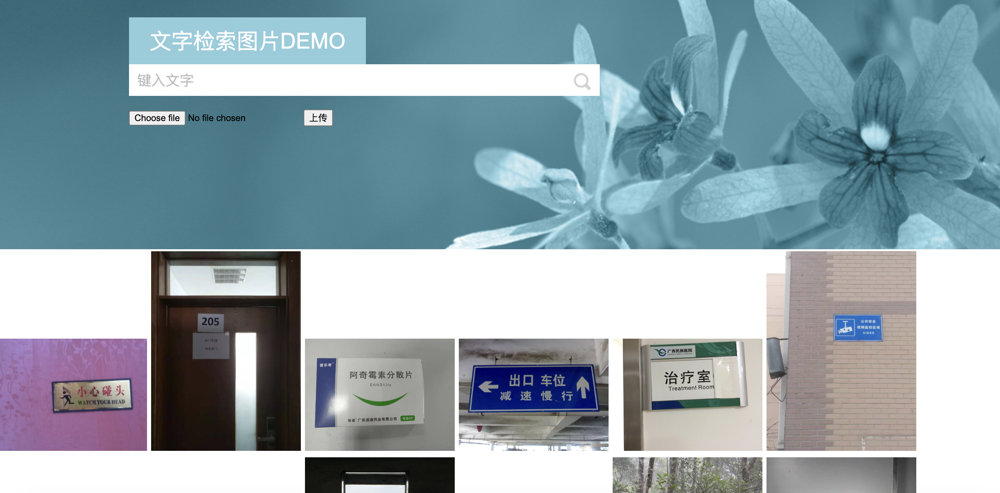
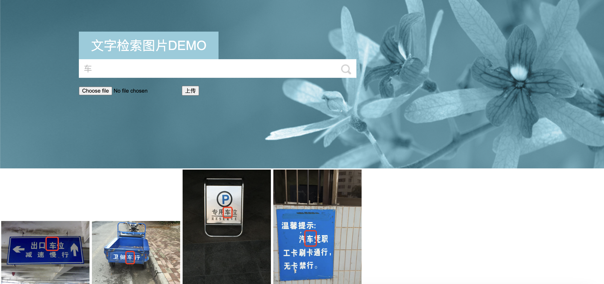

### Chinese OCR
Image Search Website——Get the targeted images containing the characters you input

- Text Area Detection: CTPN algorithm
- Characters Recognition: DenseNet + CTC
- WebSite: Flask
- Images Search: Reading and Writing of Exif information

---
Project Structure:  
- main.py: Flask running file
- ocr.py: 
  - OCR module, use CTPN ,DenseNet and CTC get characters from image files.
- ./templates
  - html files of Web Page 
- ./static
  - static files of Web Page 
- ./static/ocr_images
  - store images used for OCR
- ./densenet
  - DenseNet + CTC modules, recognise Chinese Characters in the Character area. 
- ./ctpn
  - Character area detection module 
---

The home page

The search result page
